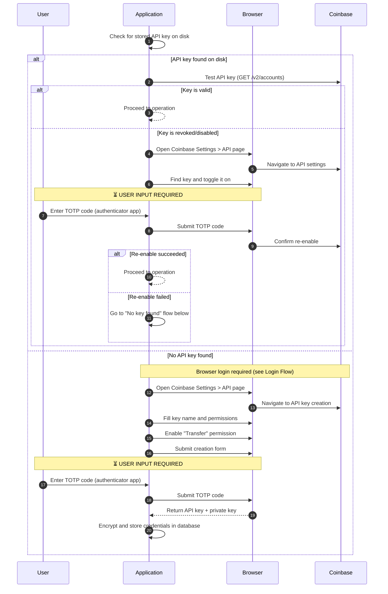
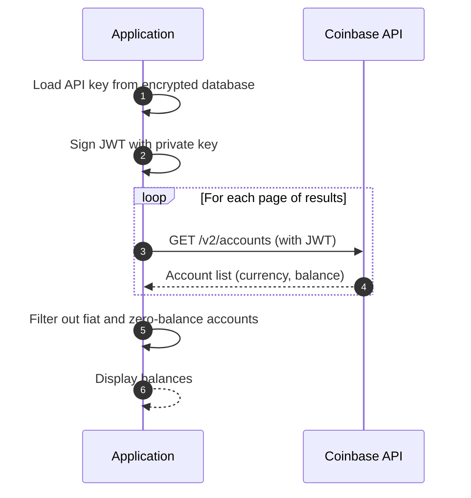
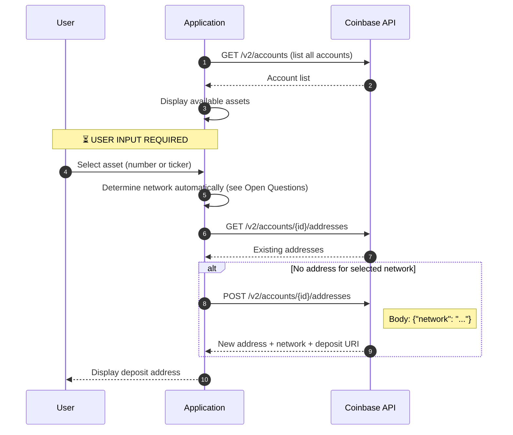
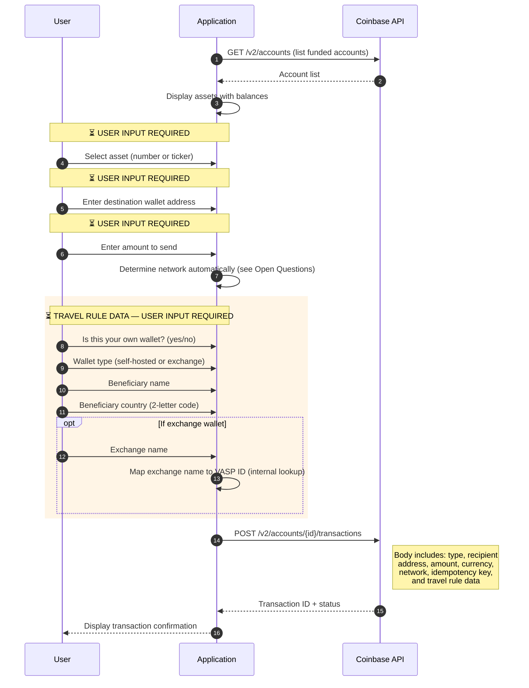

# Coinbase API Integration

> **Audience:** Legal and Compliance team
> **Related:** [Overview](README.md) · [Browser Integration](coinbase-browser-integration.md)

## How It Works

The API integration communicates with Coinbase through their official REST API (`api.coinbase.com`). Each request is authenticated with a short-lived signed token (JWT), created using an API key and a private cryptographic key.

The API key must be created once through Coinbase's website (via an automated browser session). After that, all operations — balance checks, deposit address generation, and withdrawals — happen through direct API calls with no browser involved.

## Supported Actions

| Action | Description |
|---|---|
| **Balance** | Lists all cryptocurrency accounts and their balances |
| **Deposit** | Generates a blockchain address for receiving funds |
| **Withdraw** | Sends funds to an external wallet address |

## Flow Diagrams

### API Key Setup (One-Time)

Before the application can make API calls, it needs an API key. This diagram shows how the application obtains one.

### Balance Check

### Deposit (Generate Receive Address)

### Withdraw (Send Funds)

## User Inputs Summary

| Step | Input | Required? |
|---|---|---|
| Key setup | TOTP code (serves as confirmation to proceed) | Yes |
| Deposit | Asset selection | Yes |
| Withdraw | Asset selection | Yes |
| Withdraw | Destination address | Yes |
| Withdraw | Amount | Yes |
| Withdraw | Own wallet? (yes/no) | Yes |
| Withdraw | Wallet type | Yes |
| Withdraw | Beneficiary name | Yes |
| Withdraw | Beneficiary country | Yes |
| Withdraw | Exchange name | Conditional (exchange wallets only) |

## Authentication

Each API request carries a JWT (JSON Web Token) signed with the user's private EC key. The token:

- Expires after 120 seconds
- Contains the target API endpoint as a claim
- Is signed using the ES256 algorithm (Elliptic Curve)

No browser session or cookies are needed for API operations after the initial key setup.

## Security and Privacy Considerations

1. **API key scope:** The key is created with "Transfer" permission, authorizing the application to move funds. A compromised key could allow unauthorized withdrawals.
2. **Key storage:** The API key and private key are stored in a database, encrypted using cloud-provider-managed encryption keys (e.g., AWS KMS, GCP Cloud KMS). They are never stored as plaintext on disk.
3. **Key provisioning session:** The one-time browser session used to create the API key is held in memory for 1–5 minutes, then discarded. No session state is persisted to disk.
4. **Travel rule data:** Withdrawal operations collect personally identifiable information (beneficiary name and country). This data is sent to Coinbase and may be subject to data protection regulations.
5. **Idempotency:** Each withdrawal generates a unique idempotency key to prevent duplicate transactions. However, there is no confirmation prompt before the API call executes.
6. **Browser exposure during setup:** API key creation requires a browser session. During this step, the user's Coinbase credentials and TOTP code are entered through an automated browser — the same security considerations as the Browser Integration apply during setup.

