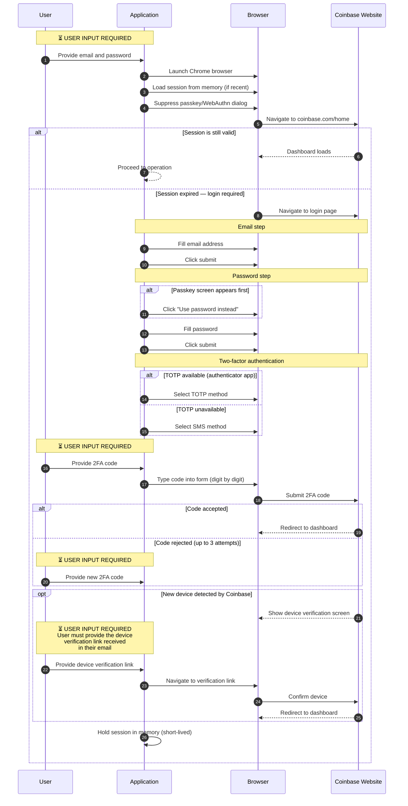
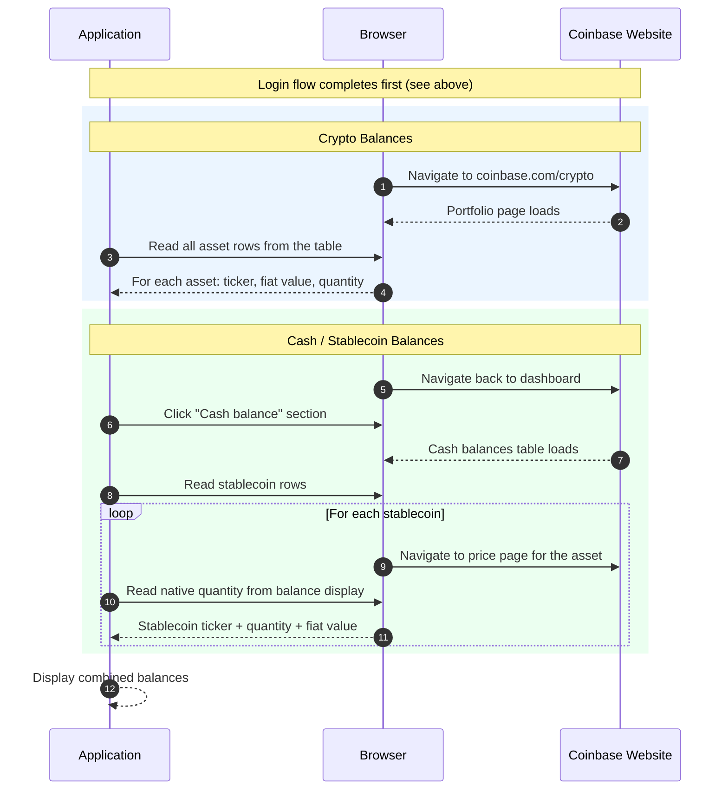
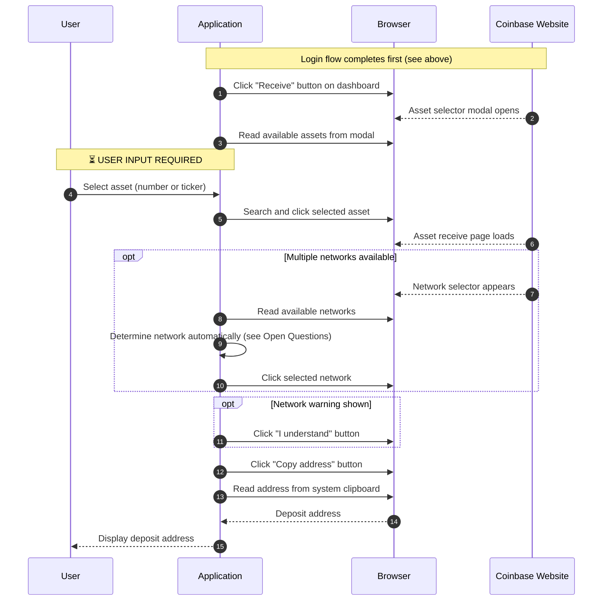

# Coinbase Browser Integration

> **Audience:** Legal and Compliance team
> **Related:** [Overview](README.md) · [API Integration](coinbase-api-integration.md)

## How It Works

The browser integration controls a real Chrome browser on the user's machine to interact with Coinbase's website directly. The application navigates pages, fills forms, clicks buttons, and reads on-screen data — the same actions a human user would perform manually.

Browser sessions are short-lived — kept in memory for a few minutes to complete the requested operation, then discarded. No session cookies are persisted to disk in production.

## Supported Actions

| Action | Description | Status |
|---|---|---|
| **Balance** | Reads cryptocurrency and cash balances from the portfolio pages | Implemented |
| **Deposit** | Opens the "Receive" modal and retrieves a deposit address | Implemented |
| **Withdraw** | Sends funds to an external address | **Not implemented** |

## Flow Diagrams

### Login Flow

Every browser operation begins with authentication. The application tries to reuse a saved session; if the session has expired, it performs a full login.

### Balance Check

### Deposit (Get Receive Address)

## User Inputs Summary

| Step    | Input                                 | Required?                     |
| ------- | ------------------------------------- | ----------------------------- |
| Login   | Email address                         | Yes                           |
| Login   | Password                              | Yes                           |
| Login   | TOTP or SMS code                      | Yes (if session expired)      |
| Login   | Device verification link (from email) | Conditional (new device only) |
| Deposit | Asset selection                       | Yes                           |

## Authentication

The browser integration authenticates the same way a human would:

1. **Email and password** are provided by the user, then submitted through Coinbase's login form.
2. **Two-factor authentication** is completed with a TOTP code (from an authenticator app) or an SMS code, also provided by the user.
3. **Device verification** may be required on first login from a new machine. The user must provide the verification link sent to their email so the application can confirm the device.
4. **Passkey suppression:** Coinbase defaults to passkey (WebAuthn) authentication. The application suppresses this dialog so it can use password-based login instead.

### Session Lifetime (Ideally)

After a successful login, the browser session is held in memory for the duration of the operation (a few minutes at most). The session is then discarded. No cookies or local storage are written to disk in production. Each new operation starts a fresh login unless a recent in-memory session is still active.

## Security and Privacy Considerations

1. **Credentials in browser:** During login, the user's email, password, and 2FA code are entered programmatically into the browser's form fields.
2. **Short-lived sessions:** Browser sessions are held in memory for a few minutes, then discarded. No session cookies are written to disk in production, limiting the window for session reuse.
3. **Passkey suppression:** The application disables Coinbase's WebAuthn/passkey prompt using Chrome DevTools Protocol. This bypasses a security feature that Coinbase enables by default.
4. **Clipboard access:** The application reads the system clipboard to retrieve deposit addresses. It requests clipboard permissions from the browser at startup.
5. **Anti-detection measures:** The browser uses modified settings to avoid being detected as automated (disabled automation flags, custom user-agent string). This is necessary for the integration to function but means the browser does not present itself to Coinbase as an automated client.
6. **Page content capture:** The application takes screenshots and saves page HTML at various steps for debugging. **Only for the development environment**. We will not get HTML content on production.
7. **Network traffic logging:** All HTTP requests and responses are logged, including headers and bodies. Logs may contain authentication tokens and account information.
8. **No withdrawal confirmation:** Withdraw is not yet implemented in the browser integration. When implemented, the same on-screen visibility and logging concerns will apply.

