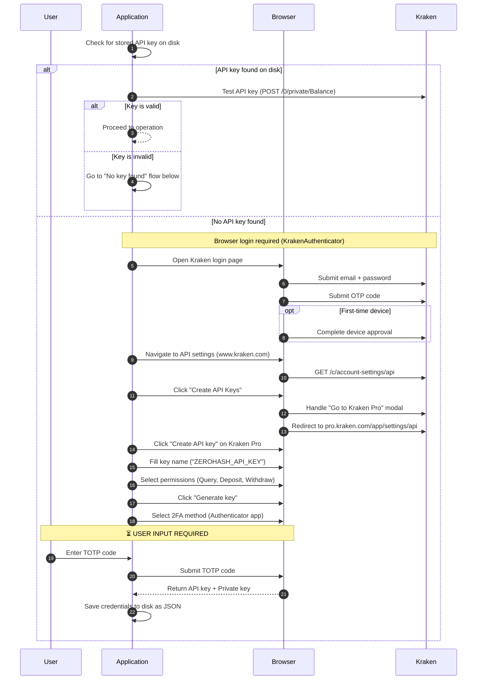
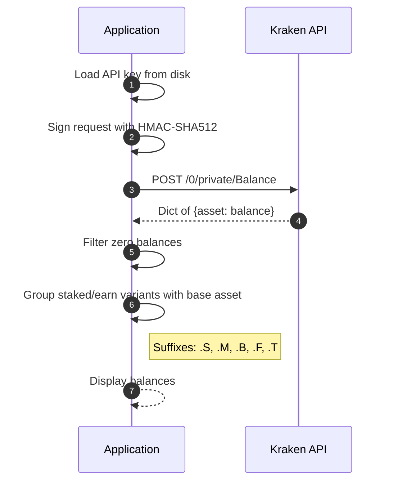
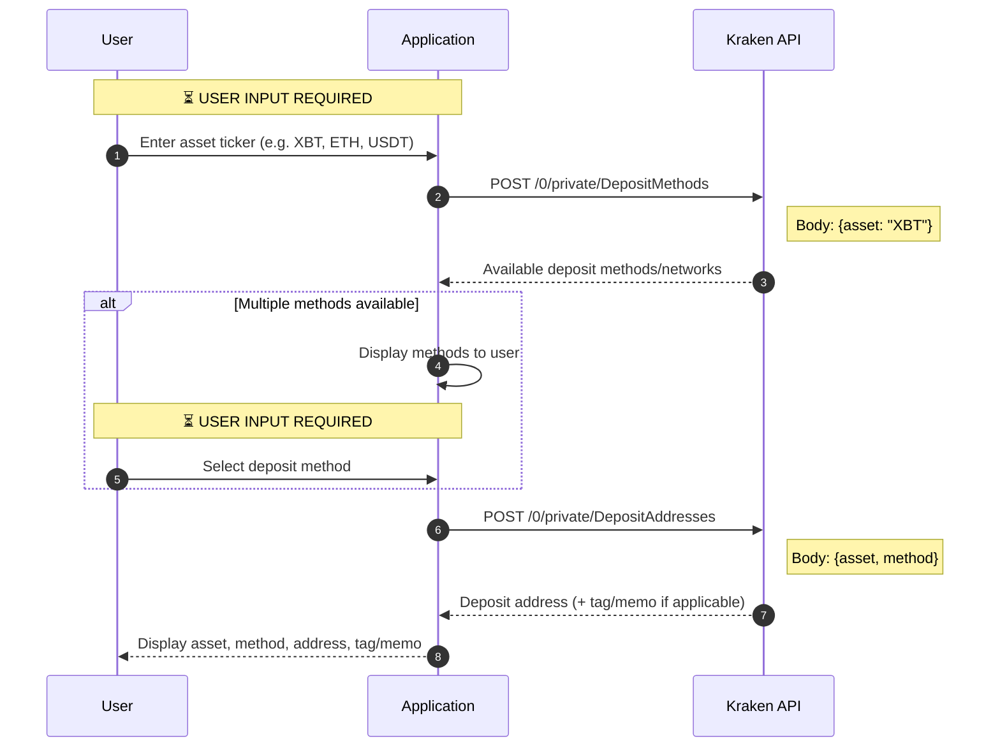
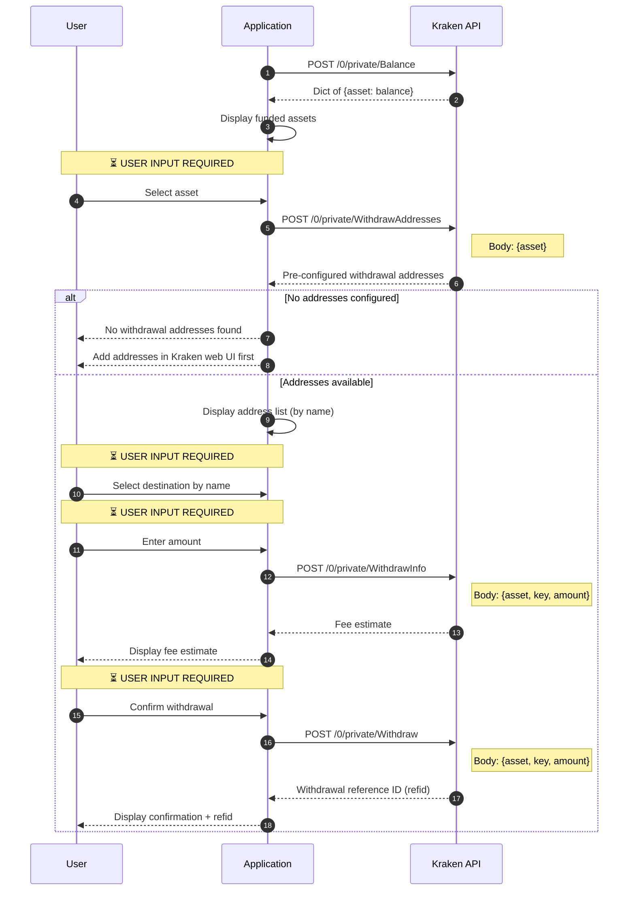

# Kraken API Integration

> **Audience:** Legal and Compliance team
> **Related:** [Overview](README.md) · [Coinbase API Integration](coinbase-api-integration.md)

## How It Works

The API integration communicates with Kraken through their REST API (`api.kraken.com`). Each request is authenticated with an HMAC-SHA512 signature, created using a public API key and a base64-encoded private key.

The API key must be created once through Kraken Pro's website (via an automated browser session). After that, all operations — balance checks, deposit address generation, and withdrawals — happen through direct API calls with no browser involved.

Unlike Coinbase, Kraken uses symmetric-key authentication (shared secret) rather than asymmetric (public/private key pair). This means anyone with the private key string can sign valid requests.

## Supported Actions

| Action | Description |
|---|---|
| **Balance** | Lists all cryptocurrency holdings, grouping staked/earn variants with their base asset |
| **Deposit** | Discovers deposit methods for an asset and retrieves or generates a deposit address |
| **Withdraw** | Sends funds to a pre-configured withdrawal address after showing a fee estimate |

## Flow Diagrams

### API Key Setup (One-Time)

Before the application can make API calls, it needs an API key. This diagram shows how the application obtains one.

The setup requires cross-platform navigation: it starts on `www.kraken.com`, then redirects to `pro.kraken.com` where the key is actually created. If an existing key is invalid, a new one must be created — Kraken has no re-enable flow.



### Balance Check



### Deposit (Generate Receive Address)



### Withdraw (Send Funds)



## User Inputs Summary

| Step | Input | Required? |
|---|---|---|
| Key setup | TOTP code | Yes |
| Deposit | Asset ticker | Yes |
| Deposit | Method selection (if multiple) | Conditional |
| Withdraw | Asset selection | Yes |
| Withdraw | Destination address (from pre-configured list) | Yes |
| Withdraw | Amount | Yes |
| Withdraw | Fee confirmation | Yes |

## Authentication

Each API request carries two headers:

- **`API-Key`**: The public API key string
- **`API-Sign`**: `Base64(HMAC-SHA512(key=Base64Decode(api_secret), message=url_path + SHA256(nonce + POST_data)))`

Every private endpoint requires a `nonce` body parameter — a strictly increasing integer. The application uses the current millisecond UNIX timestamp.

All private endpoints use POST. No browser session or cookies are needed for API operations after the initial key setup.

## Credentials Storage

The API key and private key are stored as a JSON file on disk:

**Path:** `.context/kraken-api/user/{id}/api_credentials.json`

```json
{
  "api_key": "VtbT03JvxQoMx6Ic88eRe/...",
  "api_secret": "EUEtRGRQjXA7ccnTQ1NoLUbi5TIYM3..."
}
```

## Security and Privacy Considerations

1. **API key scope:** The key is created with Query, Deposit, and Withdraw permissions. A compromised key could allow unauthorized fund movement.
2. **Key storage:** The API key and private key are stored as plaintext JSON on disk in the `.context/` directory. They are not encrypted at rest.
3. **HMAC secret:** The private key is a base64-encoded symmetric secret. Anyone with this string can sign valid API requests — there is no separate public/private key distinction.
4. **Withdrawal address restriction:** Kraken requires withdrawal addresses to be pre-configured in the web UI. Attackers with a compromised API key can only withdraw to addresses the account owner has already approved. This limits the blast radius of a key leak.
5. **Nonce collisions:** The nonce uses millisecond UNIX timestamps. Multiple processes sharing one API key could produce duplicate nonces, causing request failures.
6. **Confirmation prompt:** Balance and deposit operations execute immediately. Withdrawals show a fee estimate and ask for user confirmation before executing.
7. **Browser exposure during setup:** API key creation requires a browser session. During this step, the user's Kraken credentials and TOTP code are entered through an automated browser — the same security considerations as any browser-automated login apply.

## How to Run

```bash
just kraken-api-balance        # Check balances
just kraken-api-deposit        # Generate deposit address
just kraken-api-withdraw       # Send funds
```
